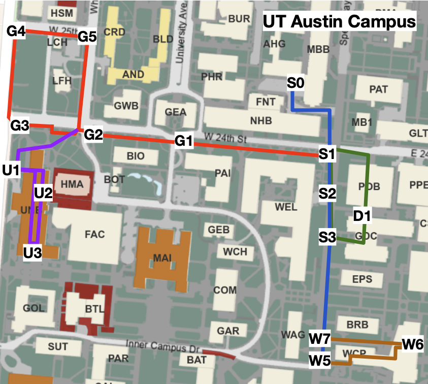

```
###########################################################################
#                 UT Austin Campus Object Dataset (CODa)                  #
#                                                                         #
#   Principal Investigators                                               #
#   Arthur Zhang                        Dr. Joydeep Biswas                #
#   University of Texas at Austin       University of Texas at Austin     #
#   2317 Speedway, Austin, TX 78712     2317 Speedway, Austin, TX 78712   #
#   arthurz@cs.utexas.edu               joydeepb@cs.utexas.edu            #
#                                                                         #
#   Co-Investigators                                                      #
#       Chaitanya Eranki        (chai77@cs.utexas.edu)                    #
#       Christina Zhang         (yymzhang@cs.utexas.edu)                  #
#       Raymond Hong            (raymond22@cs.utexas.edu)                 #
#       Pranav Kalyani          (pranavkalyani@cs.utexas.edu)             #
#       Lochana Kalyanaraman    (lochanakalyan@cs.utexas.edu)             #
#       Arsh Gamare             (arsh.gamare@utexas.edu)                  #
#       Maria Esteva            (maria@tacc.utexas.edu)                   #
#                                                                         #
#   Data Collection Period/Location                                       #
#       2023-01-16  to  2023-02-10                                        #
#       University of Texas at Austin (30.2849° N, 97.7341° W)            #
#                                                                         #
#   Supported By:                                                         #
#       Autonomous Mobile Robotics Laboratory (AMRL)                      #
#       University of Texas at Austin                                     #
#       Texas Advanced Computing Center                                   #
#                                                                         #
###########################################################################
```

## Terms of Use

CODa is available for non-commerical under a Creative Commons Attribution-NonCommercial-ShareAlike 4.0 International Public License (“CC BY-NC-SA 4.0”). The CC BY-NC-SA 4.0 may be accessed at https://creativecommons.org/licenses/by-nc-sa/4.0/legalcode . When You download or use the Datasets from the websites or elsewhere, you are agreeing to comply with the terms of CC BY-NC-SA 4.0 as applicable, and also agreeing to the Dataset Terms. Where these Dataset Terms conflict with the terms of CC BY-NC-SA 4.0, these Dataset Terms shall prevail.

# Citation
If you use our dataset of the tools, we would appreciate if you cite both our dataset and paper. 

### Paper Citation
```
@inproceedings{zhang2023ijjr,
  author = {A. Zhang, C. Eranki, C. Zhang, R. Hong, P. Kalyani, L. Kalyanaraman, A. Gamare, M. Esteva, J. Biswas},
  title = {{Towards Robust 3D Robot Perception in Urban Environments: The UT Campus Object Dataset}},
  booktitle = {},
  year = {2023}
}
``` 

### Dataset Citation
```
@data{coda-tdr,
author = {Zhang, Arthur and Eranki, Chaitanya and Zhang, Christina and Hong, Raymond and Kalyani, Pranav and Kalyanaraman, Lochana and Gamare, Arsh and Esteva, Maria and Biswas, Joydeep},
publisher = {Texas Data Repository},
title = {{UT Campus Object Dataset (CODa)}},
year = {2023},
version = {0.1},
doi = {10.18738/T8/BBOQMV},
url = {https://doi.org/10.18738/T8/BBOQMV}
}
```

# Installing the Official CODa Development Kit

The CODa development kit provides scripts for downloading, visualizing, and interfacing with CODa and can be installed from pip using the following command:

```
pip install coda-devkit
```

# Dataset Contents
The dataset contains the following:
- 8.5 hours of egocentric, multimodal sensor data
- Synchronized 3D point clouds and stereo RGB video from a 128-channel 3D LiDAR and two 1.25MP RGB cameras at 10 fps
- RGB-D videos from additional 1MP and 0.5MP sensors at 5 and 7 fps 
- 9-Degree of Freedom (DOF) Inertial data from an IMU sensor at 40 Hz 
- 28K frames (58 minutes) of ground-truth annotations containing 1.3 million 3D bounding boxes with instance IDs for 50 semantic classes 
- 5K frames of 3D semantic segmentation annotations for urban terrain
- Globally consistent pseudo-ground truth poses

# Data Collection Setup

<p align="center">
  
</p>

We collected CODa from the perspective of a mobile robot (Clearpath Husky) on UT Austin campus. We operate this robot between 0 to 1 meter per second and mount the following sensors on the robot:

- 1 x Ouster OS1-128 3D laser scanner, 128 beams, 0.35 degree angular resolution, up to 2.6 million points/second, field of view: 360 degree horizontal, 45 degree vertical, range: 128 m. Point clouds captured in 128 channels @ 10 Hz
- 2 x Teledyne FLIR Blackfly S RGB Cameras (BFS-U3-51S5C-C) up to 5 Megapixels, 75 Hz, global shutter. Paired with KOWA F2.8/5mm lenses. Field of view (H x W): 70x79 degrees. Images captured in 1.25 Megapixels @ 10 Hz
- 1 x Microsoft Azure Kinect RGBD Camera up to 12 and 1 MP (RGB and Depth) @ 15 Hz, rolling shutter. 7 microphone circular array. RGB and Depth Images captured in 2.0 MP @ 5Hz
- 1 x Stereolabs ZED 2i Stereo Camera up to 4 Megapixels @ 15 Hz, rolling shutter. Images captured in 0.5MP @ 5Hz
- 1 x Vectornav VN-310 Dual GNSS/INS, up to 800 Hz IMU Data. Inertial and GPS data captured @ 40Hz


We synchronized the Ouster 3D LiDAR and FLIR cameras using hardware. At the start of each scan, the 3D LiDAR emits a sync pulse to trigger the exposure for the FLIR cameras. We store the original ROS timestamps for the other sensors, but do not guarantee that the timestamps are synchronized with respect to the 3D LiDAR and FLIR cameras. We recorded raw sensor messages from multiple sensors using the Robot Operating System (ROS) and processed these sensor messages into individual files using the `coda-devkit`. We provide this devkit for download from pip and CODa on the Texas Dataverse. 

<p align="center">
  
</p>


Robot operators teleoperated the robot along four distinct trajectories. We refer to different trials as sequences. Under this definition, we have 22 sequences in our dataset. We define each unique trajectory by the order of waypoints visited and describe the order for each trajectory below. We marked these waypoints before data collection so that waypoint locations are identical between sequences. 

```
Trajectory Definitions:

GDC (Forward)
S0 -> S1 -> S2 -> S3 -> D1 -> S1 -> S0

GDC (Backward)
S0 -> S1 -> D1 -> S3 -> S2 -> S1 -> S0

Guad (Forward)
S0 -> S1 -> G1 -> G2 -> G3 -> G4 -> G5 -> G2 -> G1 -> S1 -> S0

Guad (Backward)
S0 -> S1 -> G1 -> G2 -> G5 -> G4 -> G3 -> G2 -> G1 -> S1 -> S0

UNB
G2 -> U1 -> U2 -> U3 -> U2 -> U1 -> G2

WCP (Forward)
S0 -> S1 -> S2 -> S3 -> W7 -> W5 -> W6 -> W7 -> S3 -> S2 -> S1 -> S0

WCP (Backward)
S0 -> S1 -> S2 -> S3 -> W7 -> W6 -> W5 -> W7 -> S3 -> S2 -> S1 -> S0
```


## Dataset Collection Schedule
We provide a summary of all of the sequences in CODa, robot operator, trajectory, sequence duration, estimated traffic level, weather, and collection date. We abbreviate the forward and backward directions as F and B respectively.

| Sequence ID   | Person    | Trajectory     | Time (secs) | Traffic Level | Weather/Brightness| Date       |
| ------------- | --------- | ------------   | ----------- | ------------- | ----------------- | ---------- |
| 0             | Raymond   | GDC (F)        | 821.2       | Light         | Cloudy            | 2023-01-16 |
| 1             | Arthur    | GDC (B)        | 870.4       | Light         | Cloudy            | 2023-01-16 |
| 2             | Chaitanya | Guad (F)       | 1669.3      | Light         | Dark              | 2023-01-16 |
| 3             | Chaitanya | GDC (B)        | 1472.3      | Medium        | Sunny             | 2023-01-17 |
| 4             | Arthur    | GDC (B)        | 823.6       | Light         | Dark              | 2023-01-18 |
| 5             | Arthur    | GDC (F)        | 721.1       | Light         | Sunset->Dark      | 2023-01-18 |
| 6             | Pranav    | WCP (B)        | 1358.2      | Medium        | Sunny             | 2023-01-26 |
| 7             | Pranav    | Guad (F)       | 1619        | Medium        | Sunny             | 2023-01-26 |
| 8             | Chaitanya | UNB            | 1020.8      | Light         | Cloudy            | 2023-01-27 |
| 9             | Christina | WCP(B)         | 1228.9      | Medium        | Dark              | 2023-01-27 |
| 10            | Raymond   | WCP (F)        | 1331.4      | Medium        | Cloudy            | 2023-01-30 |
| 11            | Christina | WCP (B)        | 1648.9      | Light         | Sunny             | 2023-02-03 |
| 12            | Pranav    | Guad (B)       | 1968.7      | Light         | Cloudy            | 2023-02-03 |
| 13            | Christina | WCP (F)        | 1539.4      | Heavy         | Cloudy/Rainy      | 2023-02-06 |
| 14            | Chaitanya | UNB            | 1198.6      | Light         | Cloudy            | 2023-02-06 |
| 15            | Chaitanya | UNB            | 1133.8      | Medium        | Dark/Rainy        | 2023-02-07 |
| 16            | Pranav    | Guad (F)       | 1706.2      | Heavy         | Cloudy/Rainy      | 2023-02-08 |
| 17            | Lochana   | Guad (B)       | 1951.9      | Medium        | Sunny             | 2023-02-08 |
| 18            | Pranav    | GDC (B)        | 876.3       | Medium        | Sunny             | 2023-02-09 |
| 19            | Lochana   | GDC (F)        | 1443.9      | Medium        | Sunny             | 2023-02-09 |
| 20            | Raymond   | WCP (F)        | 1402.7      | Heavy         | Sunny             | 2023-02-09 |
| 21            | Arthur    | Guad (B)       | 2152.9      | Light         | Cloudy/Clear      | 2023-02-10 |
| 22            | Chaitanya | WCP (F)        | 1551.5      | Medium        | Sunny             | 2023-02-10 |

# Dataset Organization
CODa is organized in the following levels: the data modality (2D/3D), sensor type, and sequence number. We recommend users first inspect the metadata under the <b>metadata</b> directory to understand which files should be used for their task. The metadata files contain the file paths to the ground truth annotations relative to the root location where CODa is downloaded on your file system.  For instance, there are lists that define the annotation files for the train, validation, and test splits for the 3D object detection and 3D semantic segmentation tasks. The data for CODa is organized in the following folder structure:

```
- CODa
    - 2d_raw
        - {cam0/cam1}
            - {SEQUENCE}
                - 2d_raw_{cam0/cam1}_{SEQUENCE}_{FRAME}.png
        - {cam2/cam3/cam4}
            - {SEQUENCE}
                - 2d_raw_{cam2/cam3/cam4}_{SEQUENCE}_{TIMESTAMP}.png
    - 2d_rect
        - {cam0/cam1}
            - {SEQUENCE}
                - 2d_rect_{cam0/cam1}_{SEQUENCE}_{FRAME}.jpg
    - 3d_bbox
        - os1
            - 3d_bbox_os1_{SEQUENCE}_{FRAME}.json
    - 3d_comp
        - os1
            - {SEQUENCE}
                - 3d_comp_os1_{SEQUENCE}_{FRAME}.bin
    - 3d_raw
        - os1
            - {SEQUENCE}
                - 3d_raw_os1_{SEQUENCE}_{FRAME}.bin
        - {cam2/cam3}
            - {SEQUENCE}
                - 3d_raw_{cam2/cam3}_{SEQUENCE}_{TIMESTAMP}.bin
    - 3d_semantic
        - os1
            - {SEQUENCE}
                - 3d_semantic_os1_{SEQUENCE}_{FRAME}.bin
    - calibrations
        - {SEQUENCE}
            - calib_cam0_intrinsics.yaml
            - calib_cam0_to_cam1.yaml
            - calib_cam1_intrinsics.yaml
            - calib_os1_to_base.yaml
            - calib_os1_to_cam0.yaml
            - calib_os1_to_cam1.yaml
            - calib_os1_to_vnav.yaml
    - metadata 
    - metadata_md
    - metadata_small
    - poses
        - dense
        - gps
        - gpsodom
        - imu
        - inekfodom
        - mag
    - timestamps
```

## Sensor Name to Sensor Hardware Abbreviations
```
os1   -> Ouster OS1-128 3D LiDAR. Hardware number: 840-102145-D (Synchronized with cam0 and cam1 @ 10Hz)
cam0  -> Left Teledyne FLIR Blackfly S RGB Camera. Model Number: BFS-U3-51S5C-C (Synchronized with OS1 @ 10Hz)
cam1  -> Right Teledyne FLIR Blackfly S RGB Camera. Model Number: BFS-U3-51S5C-C (Synchronized with OS1@ 10Hz)
cam2  -> Microsoft Azure Kinect RGBD Camera (Unsynchronized @ 5 Hz)
cam3  -> Left Stereolabs ZED 2i Stereo Camera (Unsynchronized @ 5 Hz)
cam4  -> Right Stereolabs ZED 2i Stereo Camera (Unsynchronized @ 5 Hz)
vnav  -> Vectornav VN-310 Dual GNSS/INS (Unsynchronized @ 40 Hz)
```

## Calibration Files (With Examples)

For information on how we obtain the LiDAR Camera, LiDAR IMU, and Camera Camera calibrations, please refer to our paper.

**calib_cam0_to_cam1.yaml** - Transformation matrix from cam0 to cam1
```
extrinsic_matrix:
  R:
   rows: 3
   cols: 3
   data: [ 0.999607939093204,      -0.00728019495660303,        0.0270363988583955,
       0.00661202516157305,         0.999672512844786,         0.024721411485882,
       -0.0272075214802657,       -0.0245329538373475,         0.999328717165135 ]
  T: [ -0.197673440251558,         0.00128769601558891,         0.00253652872125049 ]

```

**calib_os1_to_{base/cam0/cam1/vnav}.yaml** - Transformation matrix from os1 to robot base, cam0, cam1, or vnav
```
extrinsic_matrix:
  rows: 4
  cols: 4
  data: [
    -0.0050614, -0.9999872, 0.0000000, 0.03,
  -0.1556502,  0.0007878, -0.9878119, -0.05,
   0.9877993, -0.0049997, -0.1556522, 0,
    0, 0, 0, 1 ]
```

**calib_cam{0/1}_intrinsics.yaml** - Camera intrinsics for cam0/cam1
```
image_width: 1224
image_height: 1024
camera_name: narrow_stereo/left
camera_matrix:
  rows: 3
  cols: 3
  data: [730.271578753826,                         0,           610.90462936767,
                         0,          729.707285068689,          537.715474717007,
                         0,                         0,                         1   ]
distortion_model: plumb_bob
distortion_coefficients:
  rows: 1
  cols: 5
  data: [-0.0559502131995934, 0.123761456061624, 0.00114530935813615, -0.00367111451580028, -0.0636070725936968]
rectification_matrix:
  rows: 3
  cols: 3
  data: [0.99977534231419884, -0.015206958507487951, 0.014765273904612077, 
    0.015024146363298435, 0.99981006328490463, 0.012414200751121740,
       -0.014951251672715080, -0.012189576169272843, 0.99981391984020351 ]
projection_matrix:
  rows: 3
  cols: 4
  data: [ 730.93414758424547, 0., 606.62505340576172, 0., 
    0., 730.93414758424547, 531.60715866088867, 0., 
    0., 0., 1., 0.     ]
```

## Poses

Each line contains 8 numbers, the first number being the timestamp for the current measurement. The last 7 numbers are the x, y, z translation and quarternion qw, qx, qy, qz denoting the rigid body transformation to the origin for the current trajectory. We will release updated global poses using the center of all trajectories as the origin in a future dataset version. Poses in the `poses` directory are generated using LeGO-LOAM at a different frequency than the os1 measurements. Most users will want to use poses from the `poses/dense` directory there is a one to one correspondence between each line in this pose file to each os1 measurement. We ensure this by linearly interpolating between our known SLAM poses.

Example Pose File: (ts x y z qw qx qy qz)
```
1673884185.768105 -0.00037586 -0.00013268 0.00001081 0.99988589 0.00019951 0.01510509 -0.00010335
1673884191.568186 0.30363009 -0.01651052 -0.00002372 0.99133541 -0.00306328 0.01296573 -0.13067749
```

## Poses Subdirectories

`gps` - GPS data estimated by the Vectornav GPS/IMU (vnav). Because of poor GPS connectivity, we will only valid GPS measurements for sequence 3. GPS measurements will be in a .txt file in the following format:
```
ts latitude longitude altitude
```

`gpsodom` - Odometry estimated by the Vectornav GPS/IMU (vnav). Because of poor GPS connectivity, the x y z and linear acceleration values in the odometry from the vnav are all zeros. However, the other values are still valid.
```
ts x y z qw qx qy qz twist_lin_x twist_lin_y twist_lin_z twist_ang_x twist_ang_y twist_ang_z
```

`imu` - Inertial information consisting of linear acceleration (accx, accy, accz), angular velocity (angx, angy, angz), and orientation (qw, qx, qy, qz).
```
ts accx accy accz angx angy angz qw qx qy qz
```

`inekfodom` - Odometry estimated from [Husky Invariant Extended Kalman Filter (InEKF) Library](https://github.com/UMich-CURLY/husky_inekf) using IMU and wheel velocities. File format is identical to `gpsodom` files.
```
ts x y z qw qx qy qz twist_lin_x twist_lin_y twist_lin_z twist_ang_x twist_ang_y twist_ang_z
```

`mag` - Magnetometer data from Vectornav GPS/IMU (vnav).
```
ts magx magy magz
```

## Timestamps and Frames (timestamps)

`timestamps` - Timestamps for each synchronized frame for the os1, cam0, and cam1. The line index in the file is the frame number and the value on each line is the frame's timestamp. The os1, cam0, and cam1 sensors are hardware synchronized. At the start of each lidar sweep, the os1 electrically begins image capture for cam0 and cam1. We treat each revolution as a single frame and use the timestamp from the os1 as the timestamp for each frame. Note that because the os1 begins the lidar sweep from the back of the robot, there may exist small point cloud image misalignments in the sensor data. Each line in the 
```
1673884185.589118
.
.
1673884190.489575
```

## Metadata Format and Usage (metadata)

There is a separate metadata file for each sequence. Each sequence's metadata file contains its set of annotated objects, the date of collection, robot operator, lighting condition, trajectory number, subdirectory path to the ground truth poses, and annotation files for the train/validation/test splits for the CODa benchmarks. In the future, we plan on extending this with sequence-specific attributes and a frames list to
indicate when the robot is indoors versus outdoors. To use the annotation files in your dataloader, simply append the annotation subpath in the metadata file to the absolute path where CODa is downloaded.

To view the metadata files for the small and medium versions of CODa, refer to the `metadata_small` and `metadata_md` directories.

```
{
    "date": "20230116",
    "operator": "arthur",
    "lighting": "clear",
    "setting": "outdoor",
    "objects": [
        "Bike",
        "Bike Rack",
        "Bollard",
    ],
    "attributes": [],
    "waypoints": {},
    "trajectory": 0,
    "poses": "poses/dense/0.txt",
    "ObjectTracking": {
        "training": [ 
            "3d_bbox/os1/0/3d_bbox_os1_0_4965.json",
            ...
            "3d_bbox/os1/0/3d_bbox_os1_0_5265.json"
        ],
        "validation": [ ... ],
        "testing": [ ... ]
    }
    "SemanticSegmentation": {
        "training": [
            "3d_semantic/os1/0/3d_semantic_os1_0_4813.bin",
            ...
            "3d_semantic/os1/0/3d_semantic_os1_0_5013.bin",
        ],
        "validation": [ ... ],
        "testing": [ ... ]
    }
}
```

# 2D/3D Sensor File Format

## 2D Modality 

All 2D images use the standard camera coordinate convention where +z is forward, +x is to the right, and +y is towards the ground.

 ```
             up  z front
              |    ^
              |   /
              |  /
              | /
              |/
  left ------ 0 ------> x right
              |
              |
              |
              |
              v
            y down
  ```

1. 2d_raw directory
All RGB from cam2, cam3, and cam4 and stored in the native capture format without modifications. The RGB images
for cam0 and cam1 were captured in RAW format and debayered using OpenCV's debayering library. The image filenames follow the naming conventions below:

```
cam0/cam1 - stored as 8 bit png with {SEQUENCE} being the sequence and {FRAME} being the frame number within the sequence. 
cam2/cam3/cam4 - stored as 8 bit png with {SEQUENCE} being the sequence and {TIMESTAMP} being the ROS timestamp from the original ROS image message.
```

2. 2d_rect directory
Contains stereo rectified RGb image pairs between cam0 and cam1. We use the provided camera calibrations to perform stereo rectification and do not crop the image after rectification to maintain the same image dimensions.
```
cam0/cam1 - stored as 8 bit jpg with {SEQUENCE} being the sequence and {TIMESTAMP} being the ROS timestamp from the original ROS image message.
```

## 3D Modality

All depth measurements are provided in meters with respect to the sensor.

1. 3d_raw directory
Contains raw 3D sensor data from os1, cam2, and cam3. Point clouds in this directory have not been egocompensated or altered in any way. We describe the file format for each sensor in the `3d_raw` directory below. All units are in meters.

```
os1 - stored as a 32 bit float binary file in the order: x y z intensity. In the filename, the {SEQUENCE} is the sequence number and {FRAME} is the frame number within the sequence. Point cloud should be reshaped to Nx4 or 128x1024x4 before use. The point clouds follow the standard LiDAR coordinate convention where +x is forward, +y is to the left, and +z is towards the sky.

               z up  x front
                 ^    ^
                 |   /
                 |  /
                 | /
                 |/
  y left <------ 0 ------ right

cam2/cam3 - stored as mono 8-bit image at the original resolution with {SEQUENCE} being the sequence and {TIMESTAMP} being the ROS timestamp from the original ROS image message. The range for cam2 is 0-3.86 meters and cam3 is 0-25 meters. To obtain the absolute depth, scale the stored 8-bit value by the min/max range of the camera. The depth clouds follow the standard depth coordinate convention where +x is to the right, +y is forwards, and +z is to the sky.

            z up  y front
              ^    ^
              |   /
              |  /
              | /
              |/
  left ------ 0 ------> x right
```

2. 3d_comp directory
Contains ego-compensated 3D points clouds for the os1 sensor. We linearly interpolate between the ground truth poses found in each sequence's metadata file and use these poses to copmensate each point cloud. All other aspects (file naming convention, file format, point cloud shape) are otherwise identical.

# Annotation File Format

The original annotation protocol for 3D bounding and 3D semantic segmentation annotations can be found on the [annotation protocol document](https://docs.google.com/document/d/1jDa0zftRUoW168iRHGlo4c7xjLbWuKpUWrTGgRbm7W0/edit?usp=sharing). We use this annotation protocol to guide our Deepen AI annotators. We provide a high level summary of this document's contents below.

## 3D Bounding Box Annotations (3d_bbox)

We annotate the 3D LiDAR point clouds with 9 degree of freedom bounding box annotations. Along with the x, y, z box center, length, width, height, roll, pitch, and yaw, we provide occlusion and object instance IDs. We use six occlusion types as defined below:

```
None		(All object points are in view of image, easy to distinguish object in point cloud)
Light		(>5% <25% of object are object points are obstructed, object is in image and easily distinguishable in point cloud)
Medium          (>25% and <75% of object points are obstructed, object is in image and can still be distinguished in point cloud)
Heavy		(>75% and < 100% of object points are obstructed, difficult to distinguish without image or past knowledge)
Full		(All object points are obstructed, in view of image but cannot detect without past knowledge)
Unknown         (Occlusion Status is Unknown, object is not in view of image) 
```

Objects will have the same instance ID within each contiguous sequence as long as they do not exit in the point cloud scan for more than 30 frames (3 seconds). For deformable objects like pedestrians, we identify when the bounding box for the object is largest and fix the bounding box size for the duration that it is tracked. We define 56 object classes and divide them into nine parent object classes. For the object detection task, we only use 53 object classes as 3 do not have labels. We provide a standardized object class to class ID mapping in the coda-devkit [here](https://github.com/ut-amrl/coda-devkit/blob/main/helpers/constants.py).

<p align="center">
  
</p>

Each 3D bounding box is annotated with respect to the ego-LiDAR frame and follow the right hand convention. 

```
3D bounding box coordinate system.

x - roll (radians), length (m)
y - pitch (radians), width (m)
z - yaw (radians), height (m)

               z up  x front
                 ^    ^
                 |   /
                 |  /
                 | /
                 |/
  y left <------ 0 ------ right
```

A 3D bbox annotation file has the following format with {SEQUENCE} being the sequence and {FRAME} being the frame number within the sequence.
```
{
    "3dbbox": [
        {
        "classId": "Informational Sign",
        "instanceId": "Informational Sign:1",
        "labelAttributes": {
            "isOccluded": "None"
        },
        "cX": 19.398685458673743,
        "cY": -2.089386013412428,
        "cZ": 0.8236457885347701,
        "h": 2.929592764670508,
        "l": 0.236722416794088,
        "w": 0.554600824403446,
        "r": 0.018286544833345346,
        "p": 0.02213679515217226,
        "y": 2.704017079373707
        },
        ...
    ]
}
```

## 3D Semantic Segmentation Annotations (3d_semantic)

We annotate points on the environment terrain from the os1's point cloud. We assign each point on the terrain a semantic class and semantic ID. Points that are not on the terrain are labeled as "Unlabeled" and points that cannot be reliably identified from the point cloud/surrounding context are labeled as "Unknown". We use the following topology to organize the semantic segmentation class list. We refer the reader to the annotation protocol document for examples images of all of the semantic classes.

<p align="center">
  
</p>

Each annotation file is a binary file. Each byte is the semantic ID for the corresponding point in the 3D lidar point cloud. For instance, in an annotation file for {SEQUENCE}=10 and {FRAME}=2010, byte 0 is the semantic ID for point 0 in the point cloud with the same sequence and frame. We provide the mapping from semantic ID to semantic class name below:

```
    "Unlabeled":            0
    "Concrete":             1
    "Grass":                2
    "Rocks":                3
    "Speedway Bricks":      4
    "Red Bricks":           5
    "Pebble Pavement":      6
    "Light Marble Tiling":  7
    "Dark Marble Tiling":   8
    "Dirt Paths":           9
    "Road Pavement":        10
    "Short Vegetation":     11
    "Porcelain Tile":       12
    "Metal Grates":         13
    "Blond Marble Tiling":  14
    "Wood Panel":           15
    "Patterned Tile":       16
    "Carpet":               17
    "Crosswalk":            18
    "Dome Mat":             19
    "Stairs":               20
    "Door Mat":             21
    "Threshold":            22
    "Metal Floor":          23
    "Unknown":              24
```
